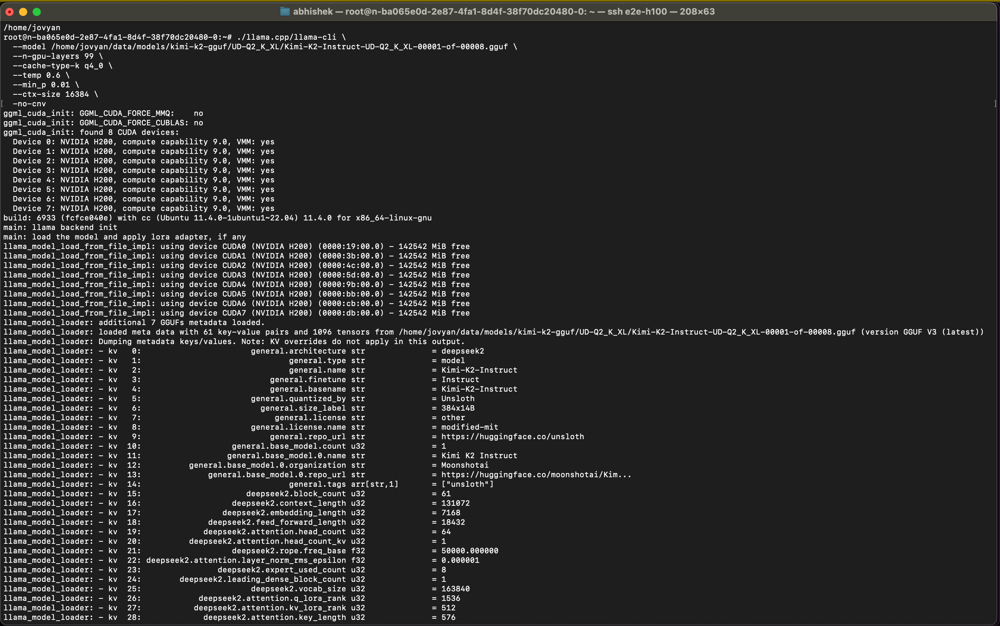
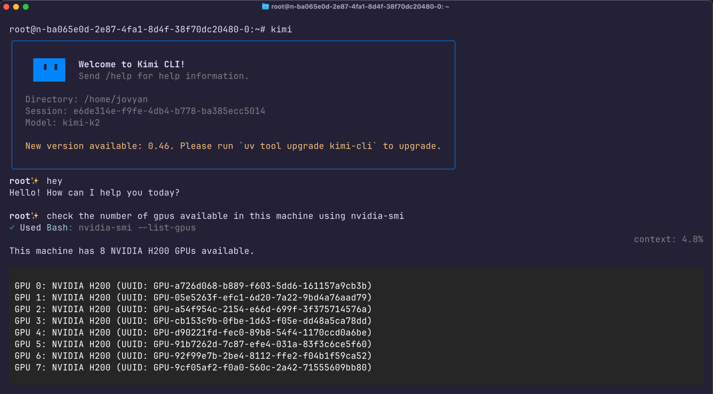
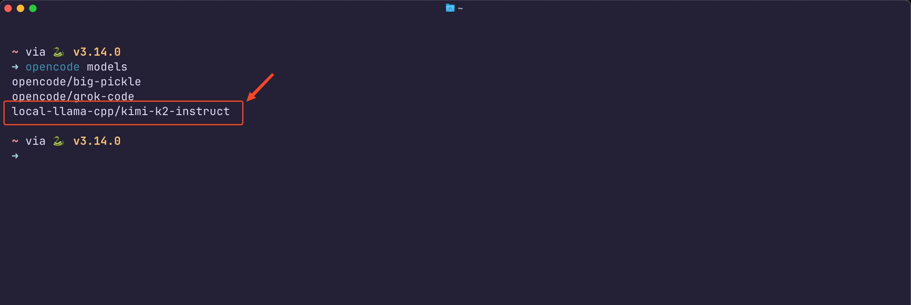
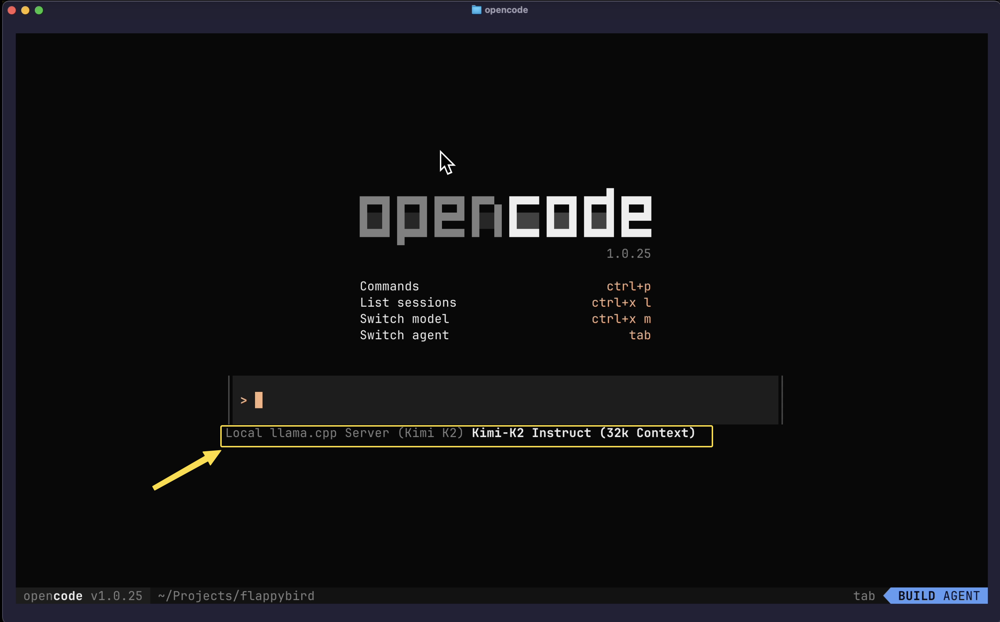

# Running Kimi-K2 Locally (Quantized GGUF) with llama.cpp

This setup runs [Kimi-K2 Instruct (Unsloth)](https://huggingface.co/unsloth/Kimi-K2-Instruct-GGUF) locally using a quantized GGUF model via `llama.cpp`, connected to both [Kimi CLI](https://kimi.moonshot.cn/) and [OpenCode CLI](https://github.com/OpenCodeAI/opencode).

## Overview

- Quantized Kimi-K2 (UD-Q2_K_XL, ~380GB)
- Run via llama.cpp with GPU offloading
- Connects to Kimi CLI (shell AI assistant)
- Connects to OpenCode CLI (code agent)
- Works via localhost or Cloudflare tunnel
- Based on E2E TIR node setup (details below)

---

## Setup Steps

### 1. Clone llama.cpp and build

```bash
git clone https://github.com/ggerganov/llama.cpp
cmake llama.cpp -B llama.cpp/build   -DBUILD_SHARED_LIBS=OFF   -DGGML_CUDA=ON   -DLLAMA_CURL=ON
cmake --build llama.cpp/build --config Release -j --clean-first
cmake --build build -j$(nproc)
cp llama.cpp/build/bin/llama-* llama.cpp/
````

### 2. Download Quantized Model (GGUF)

```bash
huggingface-cli download unsloth/Kimi-K2-Instruct-GGUF \
  --include "UD-Q2_K_XL/*" \
  --local-dir models/kimi-k2-gguf/
```

### 3. Run Model Server

```bash
./scripts/run_llama_cpp_server.sh
```

### 4. Kimi CLI Integration

```bash
uv tool install kimi-cli
# Edit ~/.kimi/kimi.json → point to http://localhost:8000/v1 (refer to  `config` folder in this repo)
# add the tunnel domain url as a base url if you are running cloudflare tunnel
```

### 5. OpenCode CLI Integration

```bash
npm install -g @opencode/cli
# Edit ~/.config/opencode/opencode.json → add llama.cpp endpoint (refer to  `config` folder in this repo)
```

### 6 (Optional) Create Cloudflare Tunnel

Follow [the cloudflare tunnel doc](https://developers.cloudflare.com/cloudflare-one/networks/connectors/cloudflare-tunnel/get-started/tunnel-useful-terms/#remotely-managed-tunnel) to create remotely-managed tunnel or locally-managed tunnel.

```bash
wget https://github.com/cloudflare/cloudflared/releases/latest/download/cloudflared-linux-amd64
chmod +x cloudflared-linux-amd64
sudo mv cloudflared-linux-amd64 /usr/local/bin/cloudflared
cloudflared tunnel --url http://localhost:8000
```


---

## Screenshots

### llama.cpp running Kimi-K2 locally


### Kimi CLI shell responses


### Opencode CLI shell responses


### Opencode CLI agent Mode



---

## Notes


See [`notes.md`](./notes.md) for gotchas, performance tips, GPU RAM used etc.
---


## E2E Cloud TIR Node Setup

- I used [E2E Networks TIR](https://tir.e2enetworks.com/) for GPU (started) with a 2xH200, setup to host this model. It comfortably runs Kimi-K2 2-bit quantized model. You can infact run the higher bit quantized models as well with the same setup.

- You can follow the [E2E Cloud TIR Node Setup guide](https://docs.e2enetworks.com/docs/tir/Nodes/GuideTIR/) to set up your own node.


---

## Related

* [moonshot's official deployment guide](https://github.com/MoonshotAI/Kimi-K2/blob/main/docs/deploy_guidance.md)
* [unsloth gguf quant releases](https://huggingface.co/unsloth/Kimi-K2-Instruct-GGUF)
* [reddit thread on 1.8-bit performance](https://www.reddit.com/r/LocalLLaMA/comments/1m0lyjn/kimi_has_impressive_coding_performance_even_deep/)
